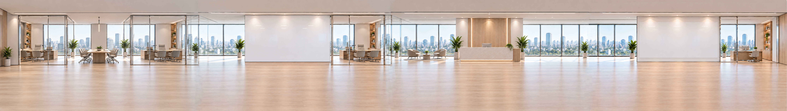
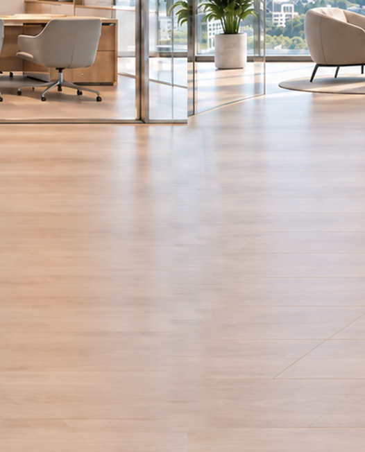

# Virtual Office prototype

Standalone, dependency-free prototype built from the supplied Figma frame (`1:2`). The panorama, characters, and sidebar icons are local copies of Figma assets.

## Run

From this folder, run `node server.js`, then open `http://localhost:4173`.

Drag, scroll, swipe, or use the left and right arrow keys to navigate. Select a person to open the prototype message card. Messages remain in the browser only and are not delivered.

The source Figma frame repeats “Alex Rivera” on its employee layers and includes empty desk bases inside layers named `employee`; the prototype retains those labels and makes those layers interactive as requested.

The AI Command Center whiteboard has a sample weekly activity bar chart, and the Case Management Office whiteboard has a sample case mix pie chart. Both are positioned inside the scrolling panorama.

Phase I

The original source material exhibited visible seams and inconsistent styles, lacking a sense of spatial continuity. I generated the main room, sections incorporating the left (or right) walls, and supplementary assets, enabling modular customization or expansion of the space.
原素材中出现明显的接缝和风格不统一，没有连续空间感。我生成了主房间和包含左（右）墙的房间和修饰素材，可以模块化的定制或拓展空间。

Phase II 

Photoshop was used to process the seams between the rooms.
使用了Photoshop处理房间之间的接缝

Phase III

Different room layouts and logo textures are used to distinguish between rooms, and pop-up dialog boxes have been created to label the room names.
不同的房间布局和logo贴图用来区分房间，创建了弹出式的对话框用于标注房间名称。

Phase IV

Implemented horizontal scrolling and dragging effects for the image, and fixed an issue where zooming only affected the UI without scaling the image itself; current memory usage is 107 MB. Also resolved issues with incomplete display and the inability to scroll vertically on mobile devices.
图片实现了左右滚动和拖动效果，修正了缩放时只有ui变化画面不放大的问题，现在的网页内存占用率为107MB。修正了移动端画面显示不完整及不能上下拖动交互的问题。

Phase V 

The source files were annotated with tags (such as "employee," "officer," and "place"), and the Figma setup categorized elements into fixed UI components and movable areas. An asset pack (comprising rooms, decorations, and employee UI elements) was created to enable future designers to expand the space and functionality.
源文件中标记了（员工，officer，place等标签），Figma中创建了固定ui和可以移动区域的分类。创建了素材包（房间，装饰，员工ui）以供未来设计师拓展空间和功能。

Phase VI

I utilized AI tools (ChatGPT, Codex) for image generation and for creating source code by replicating designs from Figma source files. However, the image generation tools often failed to accurately interpret prompts, necessitating constant prompt refinement and post-processing in Photoshop.
使用了AI工具（Chatgpt，Codex），图片生成和根据Figma源文件复制设计创建源代码，Chatgpt图片生成工具大部分时间不能准确的理解提示词，需要不断的修改提示词和后期Photoshop的帮助。

